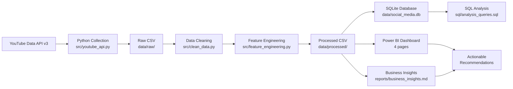

# 📊 Social Media Engagement Analytics Dashboard

> **End-to-end YouTube analytics portfolio project** — YouTube API → Python/Pandas → SQLite → Power BI

[](https://python.org)
[](https://pandas.pydata.org)
[](https://powerbi.microsoft.com)
[](https://sqlite.org)
[](LICENSE)

---

## 📌 Project Overview

This project demonstrates a complete, production-style data analytics pipeline:

1. Collect YouTube video data via the **YouTube Data API v3**
2. Clean and validate data with **Python + Pandas**
3. Engineer analytical features (engagement rate, posting time, duration category)
4. Store data in **SQLite** (or MySQL)
5. Analyse performance with **25 SQL queries** (CTEs, window functions)
6. Visualise results in an interactive **Power BI dashboard**
7. Generate **automated business recommendations** from the data

> ⚠️ A **synthetic 200-row sample dataset** is included so the project runs without a YouTube API key.
> All synthetic records are clearly labelled `SYNTHETIC_SAMPLE`.

---

## 💼 Business Problem

Content creators and marketing analysts face a key challenge: they know YouTube rewards engagement, but they don't know:
- **When** to publish to maximise engagement
- **What type** of content (duration, category) performs best
- **Which channels** maintain consistent engagement
- **Where** are the hidden-gem and improvement-opportunity videos

This project provides data-driven answers to all of these questions.

---

## 🎯 Project Objectives

| Objective | Delivered by |
|-----------|-------------|
| Collect YouTube engagement data | `src/youtube_api.py`, `src/collect_data.py` |
| Clean and validate data | `src/clean_data.py` |
| Engineer KPI columns | `src/feature_engineering.py` |
| Store in database | `src/database.py`, `sql/create_tables.sql` |
| Analyse with SQL | `sql/analysis_queries.sql` (25 queries) |
| Visualise in Power BI | `dashboard/` (guide, DAX, wireframe) |
| Automate recommendations | `src/insights.py` → `reports/business_insights.md` |
| Support beginner learning | Comments, tests, README, interview Q&A |

---

## 🛠️ Technology Stack

| Tool | Purpose |
|------|---------|
| Python 3.10+ | Core language |
| YouTube Data API v3 | Data source |
| Pandas | Data manipulation |
| NumPy | Numerical operations |
| Matplotlib | Visualisation in notebooks |
| SQLAlchemy | Database ORM |
| SQLite | Default database (no server needed) |
| MySQL | Optional production database |
| Jupyter Notebook | Exploratory data analysis |
| Power BI Desktop | Interactive dashboard |
| pytest | Unit testing |
| python-dotenv | Secure API key management |
| isodate / pytz | Duration and timezone parsing |
| Git / GitHub | Version control |

---

## 🏗️ Architecture



---

## 📁 Project Structure

```
social-media-engagement-dashboard/
│
├── data/
│   ├── raw/                         ← raw API output CSV
│   ├── processed/                   ← cleaned + enriched CSV (Power BI source)
│   └── sample/sample_youtube_data.csv  ← 200-row synthetic dataset
│
├── src/
│   ├── config.py                    ← loads .env settings
│   ├── youtube_api.py               ← YouTube API v3 wrapper
│   ├── collect_data.py              ← collection orchestrator
│   ├── clean_data.py                ← cleaning pipeline (10 steps)
│   ├── feature_engineering.py       ← derived columns (20+ features)
│   ├── database.py                  ← SQLAlchemy SQLite/MySQL loader
│   ├── generate_sample.py           ← synthetic data generator
│   ├── insights.py                  ← automated recommendations
│   └── utils.py                     ← shared helpers
│
├── sql/
│   ├── create_tables.sql            ← DDL with indexes
│   └── analysis_queries.sql         ← 25 analytical queries
│
├── notebooks/
│   ├── 01_data_cleaning.ipynb       ← step-by-step cleaning walkthrough
│   └── 02_exploratory_data_analysis.ipynb ← EDA with visualisations
│
├── dashboard/
│   ├── social_media_engagement_dashboard.pbix  ← Completed Power BI Desktop file
│   ├── power_bi_dashboard_guide.md  ← import + build instructions
│   ├── dax_measures.md              ← 27 DAX measures
│   └── dashboard_wireframe.md       ← text wireframes (4 pages)
│
├── reports/
│   ├── business_insights.md         ← auto-generated recommendations
│   └── interview_questions.md       ← 30 Q&A + 2-minute script
│
├── tests/
│   ├── test_cleaning.py             ← cleaning unit tests
│   └── test_features.py             ← feature engineering tests
│
├── screenshots/                     ← add dashboard screenshots here
├── .env.example                     ← environment variable template
├── .gitignore
├── requirements.txt
├── main.py                          ← CLI entry point
└── README.md
```

---

## 📊 Dataset Description

| Column | Type | Description |
|--------|------|-------------|
| video_id | Text | Unique YouTube video identifier |
| title | Text | Video title |
| channel_title | Text | Channel name |
| published_at | DateTime | UTC publication timestamp |
| view_count | Integer | Total views |
| like_count | Integer | Total likes |
| comment_count | Integer | Total comments |
| duration_seconds | Integer | Video length in seconds |
| engagement_rate | Float | (likes+comments)/views × 100 |
| like_rate | Float | likes/views × 100 |
| comment_rate | Float | comments/views × 100 |
| publication_day_name | Text | "Monday", "Tuesday", … |
| publication_hour | Integer | 0–23 (in reporting timezone) |
| posting_time_group | Text | "Morning", "Evening", … |
| duration_category | Text | "Short", "Medium", "Long" |
| performance_category | Text | "Low", "Average", "High", "Viral" |
| video_age_days | Integer | Days since publication |
| views_per_day | Float | view_count / video_age_days |
| is_outlier | Boolean | IQR-based outlier flag |
| data_source | Text | "API" or "SYNTHETIC_SAMPLE" |

---

## 🔑 YouTube API Setup

### Step 1 — Google Cloud Console
1. Go to https://console.cloud.google.com/
2. Click **New Project** → name it (e.g. "YouTube Analytics")
3. Click **Create**

### Step 2 — Enable YouTube Data API v3
1. In the left menu: **APIs & Services → Library**
2. Search for "YouTube Data API v3"
3. Click **Enable**

### Step 3 — Create an API Key
1. **APIs & Services → Credentials → Create Credentials → API Key**
2. Copy the key shown

### Step 4 — Restrict the Key (Recommended)
1. Click **Edit API Key**
2. Under **API restrictions**: select "YouTube Data API v3"
3. Under **Application restrictions**: select "IP addresses" and add your IP
4. Click **Save**

### Step 5 — Add Key to Project
```bash
copy .env.example .env
```
Open `.env` and replace `your_api_key_here` with your real key.

### API Quota Note
- Default quota: **10,000 units/day**
- `search.list`: 100 units per call
- `videos.list`: 1 unit per call (50 IDs max)
- Collecting 100 videos costs ≈ 202 units (well within daily limit)

---

## ⚙️ Installation (Windows)

### 1. Clone the repository
```bash
git clone https://github.com/YOUR_USERNAME/social-media-engagement-dashboard.git
cd social-media-engagement-dashboard
```

### 2. Create a virtual environment
```bash
python -m venv venv
venv\Scripts\activate
```

### 3. Install dependencies
```bash
pip install -r requirements.txt
```

### 4. Configure environment
```bash
copy .env.example .env
# Edit .env and add your YOUTUBE_API_KEY (or leave blank for sample data)
```

---

## 🚀 Running the Project

### Option A — Full pipeline with sample data (no API key needed)
```bash
python main.py run-all
```

### Option B — Step by step

```bash
# Step 1: Generate 200-row synthetic dataset
python main.py generate-sample

# Step 2 (optional): Collect real YouTube data
python main.py collect --query "data analytics" --max-results 100
python main.py collect --channel-id UC_CHANNEL_ID --max-results 50

# Step 3: Clean data + engineer features
python main.py clean

# Step 4: Load into SQLite database
python main.py load-database

# Step 5: Generate business-insights report
python main.py analyze
```

### Run tests
```bash
pytest tests/ -v
```

---

## 🧹 Data Cleaning Steps

| Step | Action | Reason |
|------|--------|--------|
| 1 | Remove exact duplicate rows | Data collection artefact |
| 2 | Remove duplicate video IDs | API may return same video twice |
| 3 | Standardise column names | snake_case consistency |
| 4 | Convert counts to int | API returns strings |
| 5 | Fill missing counts with 0 | Hidden metrics ≈ 0 |
| 6 | Drop rows with missing view_count | Cannot analyse without views |
| 7 | Remove negative values | Impossible — data corruption |
| 8 | Parse published_at to UTC datetime | Enable date analysis |
| 9 | Strip whitespace from text | Consistency |
| 10 | Fill missing titles | Placeholder for unavailable videos |
| 11 | Parse ISO 8601 duration | Convert PT4M13S → 253 seconds |
| 12 | Flag outliers | Preserve viral videos with label |

---

## 📐 Feature Engineering Formulas

| Feature | Formula |
|---------|---------|
| total_interactions | like_count + comment_count |
| engagement_rate | (total_interactions / view_count) × 100 |
| like_rate | (like_count / view_count) × 100 |
| comment_rate | (comment_count / view_count) × 100 |
| video_age_days | today − published_at |
| views_per_day | view_count / video_age_days |
| likes_per_day | like_count / video_age_days |
| comments_per_day | comment_count / video_age_days |

> All division operations use `numpy.where` to return 0 when the denominator is 0.

---

## 🗄️ SQL Analysis Highlights

25 queries in `sql/analysis_queries.sql`:

- **Queries 1–5**: Basic summary statistics
- **Queries 6–7**: Top 10 videos by views and engagement
- **Queries 8–9**: Channel performance rankings
- **Queries 10–12**: Posting-time analysis (day, hour, time group)
- **Queries 13–14**: Monthly publication and engagement trends
- **Queries 15–16**: Duration and category performance
- **Queries 17–18**: Opportunity identification (high-view/low-engagement)
- **Query 19**: Window function — RANK videos within each channel
- **Query 20**: LAG — month-over-month engagement comparison
- **Query 21**: SUM OVER() — channel share of total views
- **Queries 22–23**: Above-average performance, channel consistency
- **Query 24**: Median engagement (SQLite approximation)
- **Query 25**: Reusable channel summary CTE

---

## 📈 Power BI Dashboard

### Pages
| Page | Focus |
|------|-------|
| 1. Executive Overview | Total views, likes, comments, monthly trend, top videos |
| 2. Engagement Analysis | Engagement by channel, duration, scatter charts |
| 3. Posting-Time Analysis | Best day/hour/group heatmap, KPI cards |
| 4. Content Strategy | Category/duration performance, opportunity tables |

### How to View the Dashboard
1. Open Power BI Desktop.
2. Open [`dashboard/social_media_engagement_dashboard.pbix`](dashboard/social_media_engagement_dashboard.pbix).
3. If creating from scratch: follow [`dashboard/power_bi_dashboard_guide.md`](dashboard/power_bi_dashboard_guide.md) and load data from `data/processed/youtube_cleaned_data.csv`.

---

## 💡 Main Insights (Replace with real data results)

> *Placeholder insights — run `python main.py run-all` and check `reports/business_insights.md` for your actual data-driven results.*

- 📅 **Best posting day**: [Run pipeline to discover]
- ⏰ **Best posting hour**: [Run pipeline to discover]
- 🎯 **Best time group**: [Run pipeline to discover]
- 🎬 **Best duration**: [Run pipeline to discover]
- 📂 **Top category**: [Run pipeline to discover]
- 🏆 **Best channel**: [Run pipeline to discover]

---

## 🖼️ Dashboard Screenshots

> *Add screenshots after building the Power BI dashboard.*

| Page | Screenshot |
|------|-----------|
| Executive Overview | `screenshots/executive_overview.png` |
| Engagement Analysis | `screenshots/engagement_analysis.png` |
| Posting-Time Analysis | `screenshots/posting_time_analysis.png` |
| Content Strategy | `screenshots/content_strategy.png` |

---

## ⚠️ Limitations

1. **Public API only** — impressions, CTR, watch time, shares, and revenue are not available
2. **Hidden likes** — some creators disable the like counter; `like_count` is 0 even for popular videos
3. **Disabled comments** — `comment_count` is 0 for videos with comments turned off
4. **Publication time ≠ causation** — posting at the recommended time does not guarantee performance
5. **Age bias** — older videos have had more time to accumulate views; use `views_per_day` for fair comparison
6. **Search sampling bias** — results depend on the keywords and channels used for collection
7. **Viral video effect** — very popular videos can distort averages; median is used where possible
8. **Dataset scope** — all conclusions apply only to the analysed videos, not YouTube as a whole
9. **Timezone assumption** — `Asia/Kolkata` is the default; adjust `REPORTING_TIMEZONE` in `.env`
10. **SQLite for reporting only** — not suitable for production or multi-user environments

---

## 🔮 Future Improvements

- **YouTube Analytics API** — OAuth 2.0 access for watch time, CTR, and retention (channel owner only)
- **Scheduled collection** — automated daily incremental data collection
- **Streamlit app** — replace static Power BI with a live web dashboard
- **Comment sentiment analysis** — NLP analysis of viewer comments
- **Thumbnail analysis** — computer vision to identify high-CTR thumbnail patterns
- **Cross-platform** — add Instagram Graph API and TikTok Research API
- **Cloud database** — move SQLite to PostgreSQL/BigQuery for scale
- **Automated Power BI refresh** — scheduled dataset refresh via Power BI Service

---

## 📚 Study Order (Recommended for Beginners)

1. `README.md` — understand the project overview
2. `.env.example` — understand configuration
3. `src/config.py` — how settings are loaded
4. `src/utils.py` — helper functions
5. `src/generate_sample.py` — how sample data is created
6. `src/clean_data.py` — cleaning pipeline
7. `src/feature_engineering.py` — derived columns
8. `src/database.py` — database loading
9. `sql/create_tables.sql` — schema design
10. `sql/analysis_queries.sql` — SQL analysis
11. `src/youtube_api.py` — API wrapper (study after the above)
12. `src/collect_data.py` — API orchestration
13. `notebooks/01_data_cleaning.ipynb` — visual walkthrough
14. `notebooks/02_exploratory_data_analysis.ipynb` — EDA charts
15. `dashboard/power_bi_dashboard_guide.md` — Power BI build
16. `dashboard/dax_measures.md` — DAX formulas
17. `reports/interview_questions.md` — interview preparation
18. `tests/` — understand how to write tests

---

## 👤 Author

**[Kumar Omkar]**
- GitHub:https://github.com/25scs2040003675-IILMGN
- LinkedIn:https://www.linkedin.com/in/kumar-omkar-615b59382?

---

## 📄 License

This project is licensed under the MIT License.
See [LICENSE](LICENSE) for details.

---

*Built as a portfolio project demonstrating end-to-end data analytics skills.*
*Sample data is synthetic and does not represent real YouTube creators or videos.*
